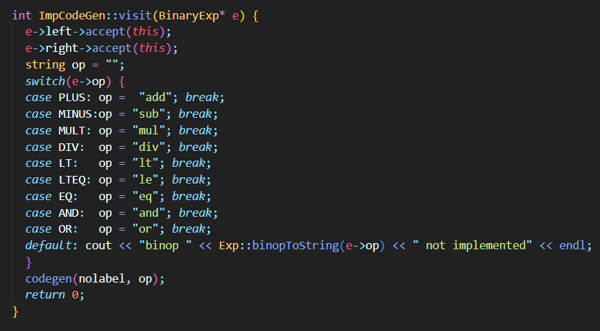
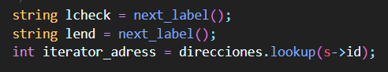
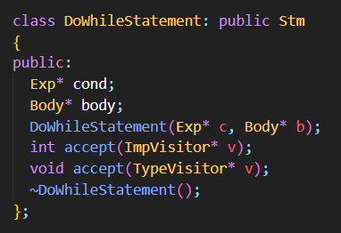
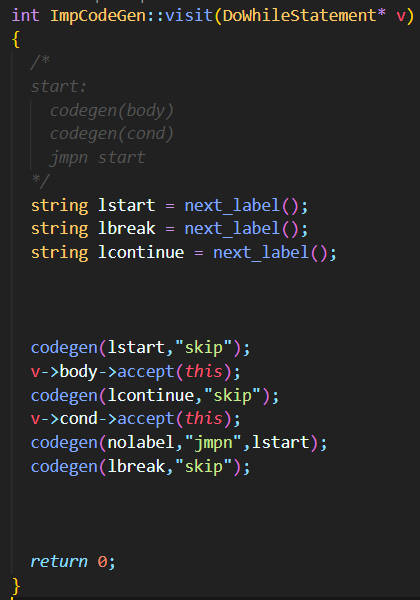

# Proyecto Compiladores
## Integrantes
- Castro Padilla, Juan Diego
- Capuñay Correa, Mariana Aurora
- Prochazka Zegarra, Juan Diego

## Implementación pregunta 1
**Agregar a IMP0 la posibilidad de incluir comentarios de una sola línea en cualquier punto del programa. Los comentarios deberán empezar con // y acabar con el fin de línea.**

La única modificación se añadió en *Scanner*:

    

- Modificamos la función nextToken, el caso en el que encuentra un ‘*’
-	Lo primero que hacemos es leer el siguiente carácter y guardarlo en c
-	Si c es igual a ‘/’, quiere decir que estamos frente a un comentario. 
    - En este caso, hacemos que este nuevo carácter, c, siga avanzando hasta que no encuentra un ‘\0’ o ‘\n’.
    -  En caso coincida con un salto de línea, hacemos que token guarde el siguiente llamado a la función. 
    - En caso coincida con el fin de archivo, asignamos un Token::END a token
-	Si c es diferente a ‘/’, retrocedemos una posición (rollBack) y retornamos un token de tipo DIV 

## Implementación pregunta 2
**Implementar la generación de código objeto para constantes booleanas, los operadores and/or y la versión de for loops considerada por el intérprete.**

### Modificaciones en codegen para expresiones booleanas

    

-	En la función visit(BoolConstExp* e), evaluamos el valor booleano de e (e->b)
-	Si e almacena true, pusheamos 1 en la pila (sin label)
-	Si e almacena false, pusheamos 0 en la pila (sin label)

        codegen(addr,boolConstant(const)) 
         ==>  push 1 ifi const = true,
              push 0 ifi const = false.

### Modificaciones en codegen para and/or

    

-	En la función visit(BinaryExp* e), generamos código objeto para la parte izquierda de la expresión binaria. 
-	Luego, generamos código objeto para la parte derecha de la expresión binaria 
-	Guardamos el operador que almacena e->op en un string, con su equivalente en la máquina de pila (tal y como vimos en clase)
-	Hemos añadido el caso en que e->op es igual a un operador AND, lo que hacemos es definir op = “and”
-	También añadimos el caso en que eop es igual a un operador OR, lo que hacemos es definir op = “or”
-	Finalmente, fuera del switch, se llama a la función codegen (sin label) y se le envía el operador encontrado (op)

        codegen(addr,binaryExpression(e1,e2,op)) 
        ==> codegen(addr,e1) 
            codegen(addr,e2)
            and              ifi op = 'and',

            codegen(addr,e1)
            codegen(addr,e2)
            or               ifi op = 'or'.
        

### Modificaciones en codegen para ForStatement

    

-	Primero, definimos la variable de iteración (sid) en el environment de direcciones

    

-	Evaluamos la primera parte de la expresión (s->e1), la cual indica dónde inicia el iterador. Como lo acabamos de evaluar, se posiciona en el top de la pila
-	Generamos código objeto para guardar en memoria el valor (evaluado) de s->e1 y lo guardamos en la posición que tiene s->id en el environment
-	Evaluamos la segunda parte de la expresión (s->e2), la cual indica dónde termina el iterador

    

-	Obtenemos los siguientes label (con next_label)
-	Guardamos el valor de la dirección x en M – espacio auxiliar de la pila (información la tiene el environment de direcciones)

    

-	Generamos código objeto para tener la siguiente estructura en la pila:

Al inicio definimos:
    
    siguiente_direccion' = siguiente_direccion + 1  
    addr' = addr[id <- siguiente_direccion]
     
Luego:

    codegen(addr,siguiente_direccion,ForExpression(id,e1,e2,body)) 
    => codegen(addr,e1)
       store addr(id)
       codegen(addr,e2)
       check: skip 
       dup
       load addr(id)
       ge
       jmpz end 
       codegen(addr',siguiente_direccion',body) 
       load addr(id) 
       push 1
       add
       store addr(id)
       goto check 
       end: skip
       pop

El codigo entre check y codegen(body) ejecuta la comparacion y el que sigue a codegen(body) incrementa la variable de iteracion. Estamos manteniendo a e2 en el stack, con lo que debemos liberarlo en el momento de salir del bucle para cumplir la invariante del stack. 

-	Finalmente, removemos el nivel de creado en el environment de direcciones y restauramos la siguiente dirección que se puede usar en la pila (dir lo obtuvimos al inicio de toda la función)

    

## Implementación pregunta 3

**Implementar la interpretación estándar de do-while. 
Nótese que el do-while no necesita un marcador como enddo. Para delimitar el fin de la sentencia. ¿Se puede implementar el parser? Pero, puede agregarse algo asi si lo desean.**

### Modificaciones en imp

    

-	Definimos la clase DoWhile (herencia de la clase Stm)
-	En imp.cpp definimos sus métodos int accept(ImpVisitor*) y void accept(TypeVisitor*)

### Modificaciones en parser
-	Como ya tenemos todos los tokens necesarios para implementar DoWhileStm, no tuvimos que realizar modificaciones en el Scanner

    

- En el parser, añadimos en parseStm la definición:

        Stm => ... | DoWhileStatement
        DoWhileStatement => "do" Body "while" Exp

### Modificaciones en Visitor's
-	En imp_visitor, definimos:

    

-	En type_visitor definimos:

    

    
### Modificaciones en Printer

    

### Modificaciones en Interprete

    

### Modificaciones en TypeChecker

    

En términos de tcheck, se usó la siguiente función:
    
    tcheck(env,DoWhileStatement(cond,body)) 
    ==>  tcheck(body) && tcheck(cond) == bool

### Modificaciones en Codegen

    

En términos de codegen, se usó la siguiente función:
    
    codegen(addr,DoWhileStatement(cond,body)) 
    ==> start: skip
        codegen(addr,body)
        codegen(addr,cond)
        jmpn start

        
## Implementación pregunta 4

